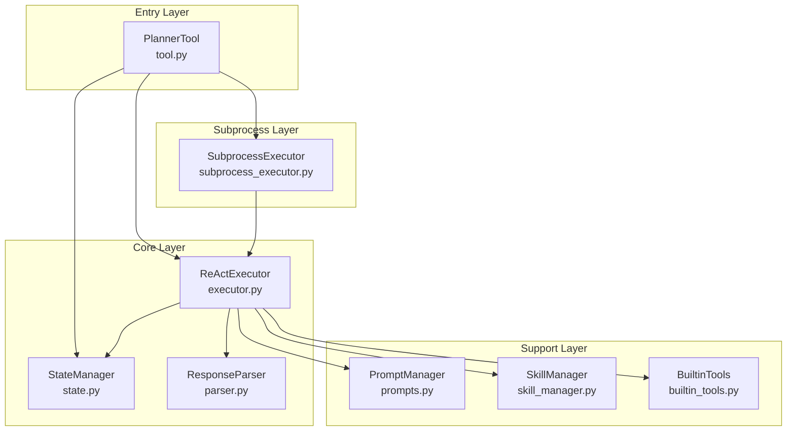

# Planner.py 重构方案

## 📊 当前状态分析

### 文件规模
- **总行数**: 2105 行
- **位置**: `components/tools/planner.py`

### 当前代码结构

```
planner.py (2105 行)
├── PlannerTool 类 (约 1200 行)
│   ├── 类变量和状态管理 (50 行)
│   ├── SYSTEM_PROMPT (约 120 行)
│   ├── stop_task/reset_task_state 等控制方法 (50 行)
│   ├── call() 入口方法 (80 行)
│   ├── execute_task() ReAct 主循环 (350 行)
│   ├── _continue_execution() 技能安装后继续执行 (220 行)
│   ├── _generate_skill_suggestion() (40 行)
│   ├── _try_auto_install() (20 行)
│   ├── _try_auto_install_and_retry() (90 行)
│   ├── _parse_tool_call_from_content() (90 行)
│   ├── _execute_tool() (50 行)
│   └── _execute_builtin_tool() (80 行)
│
├── PlannerExecutor 类 (约 500 行)
│   ├── execute_task_streaming() 流式执行 (280 行)
│   ├── _get_tool_registry() (5 行)
│   ├── _parse_tool_call_from_content() (重复代码, 20 行)
│   └── _execute_tool() (重复代码, 150 行)
│
├── SubprocessPlanner 类 (约 100 行)
│   └── 文件/PID 管理方法
│
└── TrueSubprocessPlanner 类 (约 280 行)
    ├── is_running() (30 行)
    ├── kill_process() (60 行)
    └── execute_in_subprocess() (190 行)
```

## 🔴 识别的问题

### 1. 单一职责原则违反
- **PlannerTool** 同时负责:
  - 任务状态管理
  - LLM 调用
  - 工具执行
  - 响应解析
  - 技能安装
  - 消息构建

### 2. 代码重复
- `_parse_tool_call_from_content()` 在 PlannerTool 和 PlannerExecutor 中重复
- `_execute_tool()` 逻辑在多处重复
- ReAct 循环逻辑在 `execute_task()` 和 `_continue_execution()` 中几乎相同
- 停止检查逻辑 (`is_task_stopped()`) 散布在多处

### 3. 过长的方法
- `execute_task()`: ~350 行
- `execute_task_streaming()`: ~280 行
- `_continue_execution()`: ~220 行

### 4. 硬编码的 SYSTEM_PROMPT
- 120 行的系统提示词直接嵌入代码中
- 难以维护和修改

### 5. 类职责混乱
- 4 个类在同一文件中
- `PlannerExecutor` 和 `PlannerTool` 功能重叠
- `SubprocessPlanner` 和 `TrueSubprocessPlanner` 关系不清

### 6. 状态管理问题
- 使用类变量管理状态 (如 `_task_stopped`, `_llm_call_count`)
- 可能导致并发问题

## 🟢 建议的重构架构

### 新的目录结构

```
components/tools/planner/
├── __init__.py              # 导出主要类
├── tool.py                  # PlannerTool 入口类 (~100 行)
├── executor.py              # ReAct 执行器 (~300 行)
├── state.py                 # 任务状态管理 (~100 行)
├── parser.py                # LLM 响应解析 (~150 行)
├── prompts.py               # 系统提示词 (~150 行)
├── subprocess_executor.py   # 子进程执行器 (~200 行)
├── skill_manager.py         # 技能安装管理 (~150 行)
└── builtin_tools.py         # 内置工具执行 (~100 行)
```

### 模块职责划分



### 各模块详细设计

#### 1. `state.py` - 任务状态管理

```python
class TaskState:
    """单个任务的状态"""
    task_id: str
    description: str
    stopped: bool
    llm_call_count: int
    invalid_response_count: int
    messages: list

class StateManager:
    """全局状态管理器"""
    _current_task: TaskState | None
    _stop_event: asyncio.Event
    
    def create_task(task_id, description) -> TaskState
    def stop_current_task() -> bool
    def is_stopped() -> bool
    def reset() -> None
```

#### 2. `parser.py` - 响应解析

```python
class ResponseParser:
    """LLM 响应解析器"""
    
    def parse_response(content: str) -> ParsedResponse
    def extract_tool_call(content: str) -> ToolCall | None
    def is_done_response(content: str) -> tuple[bool, str]
    def is_working_response(content: str) -> tuple[bool, str]
    def is_need_skill_response(content: str) -> tuple[bool, str]
```

#### 3. `prompts.py` - 提示词管理

```python
class PromptManager:
    """系统提示词管理"""
    
    SYSTEM_PROMPT_TEMPLATE: str
    
    def get_system_prompt() -> str
    def get_task_prompt(task: str, tools_desc: str) -> str
    def get_tool_result_hint(result: dict, task: str) -> str
    def get_invalid_response_hint(content: str) -> str
```

#### 4. `executor.py` - ReAct 执行器

```python
class ReActExecutor:
    """ReAct 循环执行器"""
    
    def __init__(self, state_manager, parser, prompt_manager, skill_manager)
    
    async def execute(
        task: str,
        max_iterations: int,
        llm_model_uuid: str,
        plugin,
        registry
    ) -> str
    
    async def execute_streaming(...) -> AsyncGenerator[str, None]
    
    # 私有方法
    async def _run_iteration(messages, iteration) -> IterationResult
    async def _call_llm_with_stop_check(messages) -> LLMResponse
    async def _handle_tool_call(tool_call, helper_plugin, registry) -> dict
```

#### 5. `skill_manager.py` - 技能管理

```python
class SkillManager:
    """技能安装和管理"""
    
    async def search_skills(query: str) -> list[Skill]
    async def install_skill(name: str) -> InstallResult
    async def try_auto_install_and_retry(
        skill_needed: str,
        executor: ReActExecutor,
        context: ExecutionContext
    ) -> str | None
    def generate_skill_suggestion(skill_needed: str) -> str
```

#### 6. `subprocess_executor.py` - 子进程执行

```python
class SubprocessExecutor:
    """子进程执行器 - 合并原有的两个类"""
    
    _PID_FILE: str
    _STOP_FILE: str
    _USER_STOP_FILE: str
    _process: subprocess.Popen | None
    
    @classmethod
    def is_running() -> bool
    
    @classmethod
    async def kill_process() -> bool
    
    @classmethod
    async def execute(task, config, ...) -> AsyncGenerator[str, None]
    
    # 文件管理
    @classmethod
    def _create_run_file() -> None
    @classmethod
    def _remove_run_file() -> None
    @classmethod
    def _check_user_stop_file() -> bool
```

#### 7. `tool.py` - 入口类

```python
class PlannerTool(Tool):
    """Planner 工具入口 - 简化版"""
    
    __kind__ = "Tool"
    
    _executor: ReActExecutor
    _state_manager: StateManager
    _subprocess_executor: SubprocessExecutor
    
    async def call(params, session, query_id) -> str
    
    @classmethod
    def stop_task(task_id: str = "default") -> bool
    
    @classmethod
    def is_task_stopped() -> bool
```

## 📋 重构步骤

### 阶段 1: 准备工作
1. 创建 `components/tools/planner/` 目录
2. 创建 `__init__.py` 导出文件
3. 备份原有 `planner.py`

### 阶段 2: 提取独立模块
1. 提取 `state.py` - 状态管理
2. 提取 `parser.py` - 响应解析
3. 提取 `prompts.py` - 提示词管理
4. 提取 `builtin_tools.py` - 内置工具

### 阶段 3: 核心重构
1. 创建 `executor.py` - ReAct 执行器
2. 创建 `skill_manager.py` - 技能管理
3. 创建 `subprocess_executor.py` - 子进程执行

### 阶段 4: 整合
1. 重写 `tool.py` 入口类
2. 更新 `__init__.py` 导出
3. 更新外部引用

### 阶段 5: 测试和清理
1. 测试所有功能
2. 删除旧的 `planner.py`
3. 更新文档

## 🎯 预期收益

| 指标 | 重构前 | 重构后 |
|------|--------|--------|
| 最大文件行数 | 2105 行 | ~300 行 |
| 代码重复 | 高 | 低 |
| 可测试性 | 差 | 好 |
| 可维护性 | 差 | 好 |
| 职责清晰度 | 混乱 | 清晰 |

## ⚠️ 风险和注意事项

1. **向后兼容性**: 需要确保外部调用接口不变
2. **状态管理**: 重构时需要仔细处理类变量的迁移
3. **测试覆盖**: 建议在重构前增加测试用例
4. **渐进式重构**: 可以分阶段进行，每阶段验证功能

## 🤔 需要确认的问题

1. 是否需要保持与现有 API 的完全兼容？
2. 是否有自动化测试可以验证重构后的功能？
3. 是否需要同时重构 `planner_subprocess.py`？
4. 对于 `PlannerExecutor` 和 `PlannerTool` 的功能重叠，是否可以合并？
